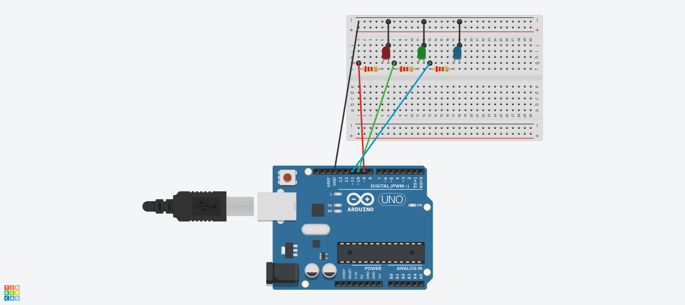

## What?
Counting numbers from 1 to 100, lighting up different LEDs based on whether the number is odd or even, as well as if it is a prime number.

## Components
| Name         | Quantity | Component         |
|--------------|----------|-------------------|
| "U1"         | 1        | " Arduino Uno R3" |
| "R1, R2, R3" | 3        | "220 Ω Resistor"  |
| "D1"         | 1        | "Red LED"         |
| "D2"         | 1        | "Green LED"       |
| "D3"         | 1        | "Blue LED"        |

## Circuit

## Other resources
[Schematic](resources/schematic.pdf)